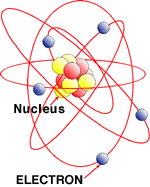
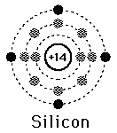
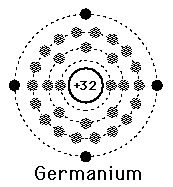
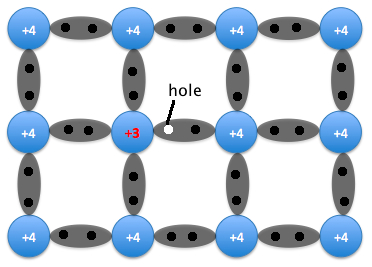
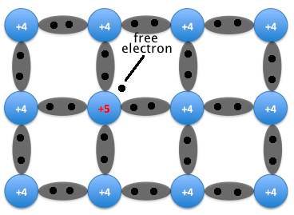

````
Basic Electronics Course Work
By Kunchala Anil
Email:anilkunchalaece@gmail.com

Reference : http://www.energyquest.ca.gov/story/chapter02.html
            http://www.bbc.co.uk/schools/gcsebitesize/science/add_ocr_21c/chemical_patterns/patternsrev1.shtml

````

**Insulators, Conductors and Semiconductors**
--

<p>
All matter is made up of atoms. and atoms are made up of smaller particles. The three main particles making up an atom are the proton, the neutron and the electron.
<br>
Electrons contain a negative charge, protons a positive charge. Neutrons are neutral – they have neither a positive nor a negative charge.
<br>
Electrons spin around the center, or nucleus, of atoms. The nucleus is made up of neutrons and protons.

<br>
Electrons are contained in shells around the nucleus. In a neutral atom the total number of electrons is always the same as the number of protons in the nucleus.These shells are also called energy levels.
<br>
The collection of energy levels associated with the outer shell electrons ( valence electrons ) is called valence band.
<br>
Now, if the electrons in the valence band gain sufficient energy they can become free electrons .They will be free to move about the entire material .The collection of energy levels associated with the free electrons is called conduction band.
<br>

The materials can be classified by the energy gap between their valence band and the conduction band. Conduction takes place when an electron jumps from valence band to conduction band and the gap between these two bands is forbidden energy gap.

<br>
In the case of <b>conductors</b>, this energy gap is absent or in other words conduction band, and valence band overlaps each other. Thus, electron requires minimum energy to jump from valence band. The typical examples of conductors are Silver, Copper, and Aluminium.In Conductors the conduction band is almost filled with free Electrons.
<br>
<br>
In <b>insulators</b>, this gap is vast. Therefore, it requires a significant amount of energy to shift an electron from valence to conduction band. Thus, insulators are poor conductors of electricity. Mica and Ceramic are the well-known examples of insulation material.In Insulators Conduction band is Empty.
<br>
<br>
<b>Semiconductors</b>, on the other hand, have an energy gap which is in between that of conductors and insulators. This gap is typically more or less 1 eV, and thus, one electron requires energy more than conductors but less than insulators for shifting valence band to conduction band. In SemiConductors the conduction band is almost empty. Silicon and Germanium are the examples of semiconductor materials.
</p>


**Covalent Bonds**
--
<p>
The three semiconductors used most frequently in the construction of electronic devices are Silicon(si), Germanium(Ge).
The Bhor Model for silicon and Germanium are shown in fig.
</p>




<p>
Silicon has 14 orbiting electrons, germanium has 32 Electronics. for germanium and silicon there are four electrons in the outer most shell, which is refered as Valance Electrons.
Boron has Three valance electrons and Antimony has Five valance Electrons as shown in fig below
</p>


<p>
Atoms that have Four valance electrons are called *tetravalent*, those with three are called *trivalent* and those with five are called *pentavalent*. The term valance is used to
indicate the potential required to remove any one of these electrons from atomic strecture is significantly lower than that required for any other electron in the structure.
<br>
In pure silicon or germanium crystal the four valance electrons of one atom form a bonding arrangement with four adjoining atoms. as shown in fig below
</p>


**Intrinsic and Extrensic Semiconductors**
--
<p>
Semiconductors in its pure form are called <b>Intrinsic Semiconductors</b>. In pure semiconductor number of electrons (n) is equal to number of holes (p) and thus conductivity is very low as valence electrons are covalent bonded.
<br>
<br>
The characteristics of semiconductor material can be altered significantly by addition of specific impurity atoms to relatively pure semiconductor material.the process of adding impurities to pure semiconductors is known as <i>dopoing</i>.
<br>
<br>
a semiconductor material that has been subjected to the doping is called an <b>extrensic Semiconductor</b>.

Based on the type of doping material incorporated, semiconductor crystals are classified into two types
1. P-type Materials
2. N-type Materials
</p>

**P-type Material**
<p>
In a pure (intrinsic) Si or Ge semiconductor, each nucleus uses its four valence electrons to form four covalent bonds with its neighbors.Since there are no excess electrons or holes In this case, the number of electrons and holes present at any given time will always be equal.
<br>
Now, if one of the atoms in the semiconductor lattice is replaced by an element with three valence electrons, such as a Trivalent Materials like Boron (B) or Gallium (Ga), the electron-hole balance will be changed. This impurity will only be able to contribute three valence electrons to the lattice, therefore leaving one excess hole. Since holes will "accept" free electrons, a trivalent impurity is also called an acceptor.
</p>

<p>
a semiconductor that has been doped with an acceptor is called a p-type semiconductor; "p" stands for positive.Notice that the material as a whole remains electrically neutral. In this case, the holes are the majority carriers, while the electrons are the minority carriers.
</p>
**N-type Material**
<p>
N-type material is created by introducing impurity elements that have <i>five</i> valance electrons (Pentavelent), such as antimony, arsenic and phosphorus.In this case, the impurity adds five valence electrons to the lattice where it can only hold four. This means that there is now one excess electron in the lattice (see figure below). Because it donates an electron, a Pentavalent impurity is called a donor. Note that the material remains electrically neutral.
<br>

<br>
Donor impurities donate negatively charged electrons to the lattice, so a semiconductor that has been doped with a donor is called an n-type semiconductor; "n" stands for negative. Free electrons outnumber holes in an n-type material, so the electrons are the majority carriers and holes are the minority carriers.
