````
Basic Electronics Course Work
By Kunchala Anil
Email:anilkunchalaece@gmail.com

Please note that all the Images and desciption are taken from Different Sites and
Text Books.. I dont own any of it.

````

**Insulators, Conductors and Semiconductors**
--

<p>
All matter is made up of atoms. and atoms are made up of smaller particles. The three main particles making up an atom are the proton, the neutron and the electron.
<br>
Electrons contain a negative charge, protons a positive charge. Neutrons are neutral – they have neither a positive nor a negative charge.
<br>
Electrons spin around the center, or nucleus, of atoms. The nucleus is made up of neutrons and protons.
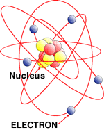
<br>
Electrons are contained in shells around the nucleus. In a neutral atom the total number of electrons is always the same as the number of protons in the nucleus.These shells are also called energy levels.
<br>
The collection of energy levels associated with the outer shell electrons ( valence electrons ) is called valence band.
<br>
Now, if the electrons in the valence band gain sufficient energy they can become free electrons .They will be free to move about the entire material .The collection of energy levels associated with the free electrons is called conduction band.
<br>

The materials can be classified by the energy gap between their valence band and the conduction band. Conduction takes place when an electron jumps from valence band to conduction band and the gap between these two bands is forbidden energy gap.

<br>
In the case of <b>conductors</b>, this energy gap is absent or in other words conduction band, and valence band overlaps each other. Thus, electron requires minimum energy to jump from valence band. The typical examples of conductors are Silver, Copper, and Aluminium.In Conductors the conduction band is almost filled with free Electrons.
<br>
<br>
In <b>insulators</b>, this gap is vast. Therefore, it requires a significant amount of energy to shift an electron from valence to conduction band. Thus, insulators are poor conductors of electricity. Mica and Ceramic are the well-known examples of insulation material.In Insulators Conduction band is Empty.
<br>
<br>
<b>Semiconductors</b>, on the other hand, have an energy gap which is in between that of conductors and insulators. This gap is typically more or less 1 eV, and thus, one electron requires energy more than conductors but less than insulators for shifting valence band to conduction band. In SemiConductors the conduction band is almost empty. Silicon and Germanium are the examples of semiconductor materials.
</p>
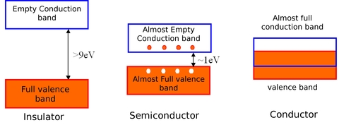


**Covalent Bonds**
--
<p>
The three semiconductors used most frequently in the construction of electronic devices are Silicon(si), Germanium(Ge).
The Bhor Model for silicon and Germanium are shown in fig.
</p>

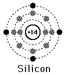


<p>
Silicon has 14 orbiting electrons, germanium has 32 Electronics. for germanium and silicon there are four electrons in the outer most shell, which is refered as Valance Electrons.
Boron has Three valance electrons and Antimony has Five valance Electrons as shown in fig below
</p>
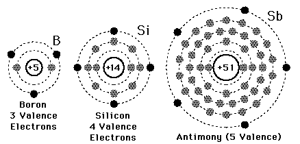

<p>
Atoms that have Four valance electrons are called *tetravalent*, those with three are called *trivalent* and those with five are called *pentavalent*. The term valance is used to
indicate the potential required to remove any one of these electrons from atomic strecture is significantly lower than that required for any other electron in the structure.
<br>
In pure silicon or germanium crystal the four valance electrons of one atom form a bonding arrangement with four adjoining atoms. as shown in fig below
</p>

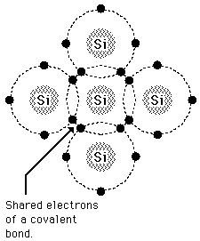

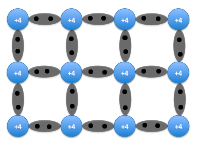

**Intrinsic and Extrensic Semiconductors**
--
<p>
Semiconductors in its pure form are called <b>Intrinsic Semiconductors</b>. In pure semiconductor number of electrons (n) is equal to number of holes (p) and thus conductivity is very low as valence electrons are covalent bonded.
<br>
<br>
The characteristics of semiconductor material can be altered significantly by addition of specific impurity atoms to relatively pure semiconductor material.the process of adding impurities to pure semiconductors is known as <i>dopoing</i>.
<br>
<br>
a semiconductor material that has been subjected to the doping is called an <b>extrensic Semiconductor</b>.

Based on the type of doping material incorporated, semiconductor crystals are classified into two types
1. P-type Materials
2. N-type Materials
</p>

**P-type Material**
<p>
In a pure (intrinsic) Si or Ge semiconductor, each nucleus uses its four valence electrons to form four covalent bonds with its neighbors.Since there are no excess electrons or holes In this case, the number of electrons and holes present at any given time will always be equal.
<br>
Now, if one of the atoms in the semiconductor lattice is replaced by an element with three valence electrons, such as a Trivalent Materials like Boron (B) or Gallium (Ga), the electron-hole balance will be changed. This impurity will only be able to contribute three valence electrons to the lattice, therefore leaving one excess hole. Since holes will "accept" free electrons, a trivalent impurity is also called an acceptor.
</p>

<p>
a semiconductor that has been doped with an acceptor is called a p-type semiconductor; "p" stands for positive.Notice that the material as a whole remains electrically neutral. In this case, the holes are the majority carriers, while the electrons are the minority carriers. The P-type material is electrically neutral.
</p>
**N-type Material**
<p>
N-type material is created by introducing impurity elements that have <i>five</i> valance electrons (Pentavelent), such as antimony, arsenic and phosphorus.In this case, the impurity adds five valence electrons to the lattice where it can only hold four. This means that there is now one excess electron in the lattice (see figure below). Because it donates an electron, a Pentavalent impurity is called a donor. Note that the material remains electrically neutral.
</p>
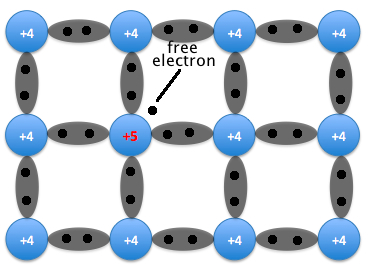
<p>
Donor impurities donate negatively charged electrons to the lattice, so a semiconductor that has been doped with a donor is called an n-type semiconductor; "n" stands for negative. Free electrons outnumber holes in an n-type material, so the electrons are the majority carriers and holes are the minority carriers.
<br>
It is important to realize that even though a large number of free carriers have been established in the n -type material, it is still electrically neutral since ideally the number of positively charged protons in the nuclei is still equal to the number of free and orbiting negatively
charged electrons in the structure
</p>

**PN Junction Diode**
--
<p>
The PN juction diode also known as Semi conductor diode is created by simply joining an N-type and P-type Material together.
<br>
Since the n-type region has a high electron concentration and the p-type a high hole concentration, electrons diffuse from the n-type side to the p-type side. Similarly, holes flow by diffusion from the p-type side to the n-type side. If the electrons and holes were not charged, this diffusion process would continue until the concentration of electrons and holes on the two sides were the same.
On the n-type side, positive ion cores are exposed. On the p-type side, negative ion cores are exposed. An electric field Ê forms between the positive ion cores in the n-type material and negative ion cores in the p-type material. This region is called the "depletion region"
</p>
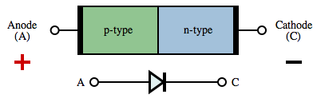
<br>
Pn Juction Diode Schematic and Circuit Symbol

**At No-Bias Condition**
<p>
At the instant the two materials are “joined” the electrons and the holes in the region of the junction will combine, resulting in a lack of free carriers in the region near the junction, as shown in Fig
</p>
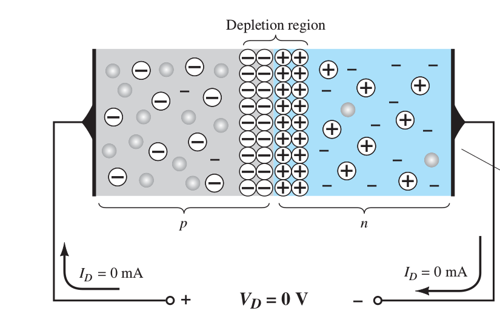
<p>
the only particles displayed in this region are the positive and the negative ions remaining once the free carriers have been absorbed.
<br>
If leads are connected to the ends of each material, a two-terminal device results, as shown in Fig . Three options then become available:
1. No bias
2. Forward bias
3. Reverse bias

The term bias refers to the application of an external voltage across the two terminals of the device to extract a response.

<br>
The condition shown in Fig is the **no-bias** situation because there is no external voltage applied.
The majority carriers (electrons) of the n -type material must overcome the attractive forces of the layer of positive ions in the n -type material and the shield of negative ions in the p -type material to migrate into the area beyond the depletion region of the p -type material. However, the number of majority carriers is so large in the n -type material that it is not possible for electrons to pass through the depletion region. same is true for the holes in p-type material.
</p>

***In the absence of an applied bias across a semiconductor diode, the net flow of charge in one direction is zero.In other words, the current under no-bias conditions is Zero***

**Reverse-Bias Condition**
<p>
If an external potential of V volts is applied across the p – n junction such that the positive terminal is connected to the n -type material and the negative terminal is connected to the p -type material as shown in Fig. the number of uncovered positive ions in the depletion region of the n -type material will increase due to the large number of free electrons drawn to the positive potential of the applied voltage. For similar reasons, the number of
uncovered negative ions will increase in the p -type material. Due to this the width of depletion region is increased. This widening of the depletion region will establish too great a barrier for the majority carriers to overcome, effectively reducing the majority carrier flow to zero, as shown in Fig.
</p>
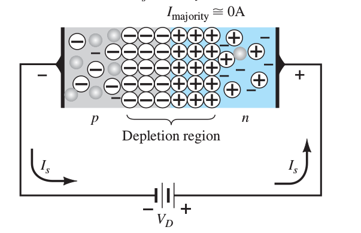
<p>
In Reverse Bias condition there is a small current due to flow of Minority Carrriers, known as reverse saturation current.
</p>

***The current that exists under reverse-bias conditions is called the reverse saturation current and is represented by I<sub>S</sub>***

<br>
**Forward-Bias Condition**
<p>
A forward-bias or “on” condition is established by applying the positive potential to the p -type material and the negative potential to the n -type material as shown in Fig
</p>
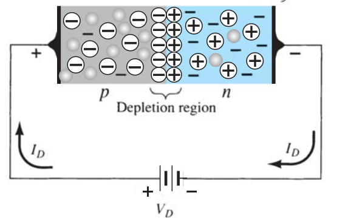
<p>
The application of a forward-bias potential V<sub>D</sub> will “pressure” electrons in the n -type material and holes in the p -type material to recombine with the ions near the boundary and reduce the width of the depletion region as shown in Fig.
the reduction in the width of the depletion region has resulted in a heavy majority flow across the junction. An electron of the n -type material now “sees” a reduced barrier at the junction due to the reduced depletion region and a strong attraction for the positive potential applied to the p -type material. As the applied bias increases in magnitude, the depletion region will continue to decrease in width until a flood of electrons can pass through the junction, resulting in an exponential rise in current as shown in the forward-bias region of the characteristics of Fig
</p>
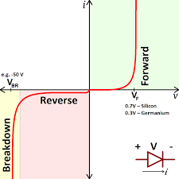

**Breakdown Region**
<p>
The application of too negative a voltage with the reverse polarity will result in a sharp change in the characteristics, shown as Breakdown in fig.The current increases at a very rapid rate in a direction opposite to that of the positive voltage region. The reverse-bias potential that results in this dramatic change in characteristics is called the breakdown potential V<sub>BR</sub>.
</p>

----------------------------------------------------------------------
<p style="text-align:center"> **Rectifiers** </p>
<p>
A device which is capable of converting a sinusoidal input waveform into unidirectional waveform, with non zero average component is called **Rectifier**.
<br>
There are three types of rectifiers
1. Half-wave Rectifier
2. Full-wave Rectifier
3. Bridge Rectifier
</p>

**Half-wave Rectifiers**
The basic circuit for Halfwave Rectifier is as shown in fig
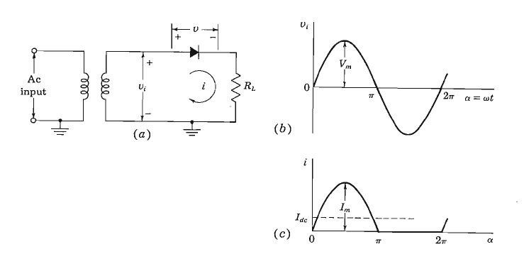
<br>
(a) Basic Circuit of Half-wave Rectiifer <br>
(b)Transformer Sinusoidal Secondary voltage <br>
(c) Diode and Load Current
<p>
input voltage to the circuit V<sub>i</sub> = V<sub>m</sub> sin <i>w</i>t has a peak value of V<sub>m</sub> which is very large compared to the Cut-in voltage of the Diode, Assume that for following discussion Cut-in voltage is Zero.
<br>
with the Diode idealized to be a resistance R<sub>f</sub> in the ON state and an open circuit in OFF state, the Current <i>i</i> in the diode or load R<sub>L</sub> is given by
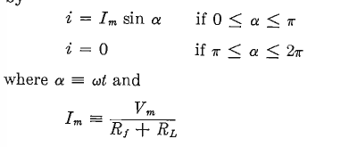
<br>
When the Trasnformer Secondary Voltage applied to the Halfwave Recitifer Circuit we get Unidirectional Current as Output as shown in fig.
<br>
*Average Value*: By Definition, the Average Value of a periodic function is given by
 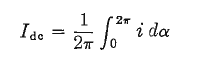
 <>
For Half wave Rectifier
